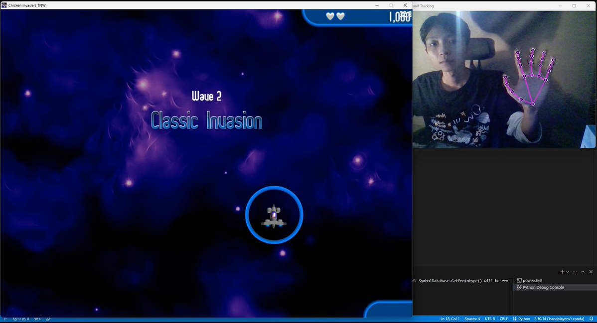

# Chicken Invaders Hand Control

This repository contains code to play Chicken Invaders using hand gestures detected by a camera.

## Table of Contents

- [Introduction](#introduction)
  - [Quick Demo Video](#Quick-Demo-Video) 
- [Requirements](#requirements)
- [Installation](#installation)
- [Usage](#usage)
- [Code Overview](#code-overview)
  - [Game Runner Class](#1-Game_Runner-Class)
  - [GameRunner](#gamerunner)

## Introduction

This project enables you to play Chicken Invaders using your hands. The camera tracks your hand movements and translates them into mouse movements and cup your hands to shoot, allowing you to control the game without using a traditional mouse.  
### Quick Demo Video
✅ [YouTube](https://youtu.be/shlkBMwmfos)  
<a href="https://youtu.be/shlkBMwmfos?si=2QF0DWRr1Iv-i_Qx" title="Play Chicken Invaders With Hand Detection">
    
</a>


## Requirements

- Python 3.10+
- OpenCV
- MediaPipe
- NumPy
- PyAutoGUI
- PyGetWindow

## Installation

1. Clone the repository:

   ```bash
   git clone https://github.com/OtaTran241/ChickenInvaders_HandPoseEstimation.git
   cd ChickenInvaders_HandPoseEstimation
   ```

2. Install the required packages:
   ```bash
   pip install -r requirements.txt
   ```
## Usage
1. Update the "Main.py" file with the correct path to your Chicken Invaders executable if necessary (should be left as default):
   ```bash
   game_runner = GameRunner(exe_path=r"path_to_your_game_executable", window_title="Chicken Invaders", window_width=1500, window_height=1000)
   ```
2. Run the "Main.py" file:
   ```bash
   python Main.py
   ```
## Code Overview

### 1. `Game_Runner` Class

This class is designed to launch and manage a game window, along with a camera tracking window.

```python
class Game_Runner:
    def __init__(self, exe_path, window_title, window_width, window_height):
        self.exe_path = exe_path
        self.window_title = window_title
        self.window_width = window_width
        self.window_height = window_height

    def run_game(self):
        subprocess.Popen([self.exe_path], creationflags=subprocess.CREATE_NEW_CONSOLE)
        time.sleep(5) 

        windows = gw.getWindowsWithTitle(self.window_title)
        if windows:
            game_window = windows[0]
            game_window.restore()
            game_window.resizeTo(self.window_width, self.window_height)
            game_window.moveTo(0, 0)

            game_window.activate()
            pyautogui.click(game_window.left + 100, game_window.top + 100) 
        else:
            print(f"Không tìm thấy cửa sổ với tiêu đề: {self.window_title}")

        camera_window_title = "Hand Tracking"
        camera_windows = gw.getWindowsWithTitle(camera_window_title)
        if camera_windows:
            camera_window = camera_windows[0]
            camera_window.resizeTo(640, 480)
            camera_window.moveTo(1920 - 640, 0) 
        else:
            print(f"Không tìm thấy cửa sổ với tiêu đề: {camera_window_title}")
```

- **Initialization (`__init__` method):**
  - **Attributes:**
    - `exe_path`: Path to the game's executable file (e.g., `exe_path="game/rungame.exe"`).
    - `window_title`: Title of the game window (e.g., `window_title="GameRunner"`).
    - `window_width`: Desired width of the game window (e.g., `window_width=1920`).
    - `window_height`: Desired height of the game window (e.g., `window_height=1080`).

- **Running the Game (`run_game` method):**
  - **Steps:**
    1. Launches the game using the specified executable path.
    2. Waits for the game window to appear (5 seconds delay).
    3. Adjusts the game window size and position according to the specified dimensions.
    4. Moves the game window to the top-left corner of the screen.
    5. Activates the game window and simulates a mouse click.
    6. Searches for a window titled "Hand Tracking," resizes it, and moves it to the top-right corner of the screen.

### 2. `HandMouseController` Class

This class utilizes Mediapipe and OpenCV to control the mouse cursor based on hand gestures detected by the webcam.

```python
class HandMouseController:
    def __init__(self, screen_width=1920, screen_height=1080, min_detection_confidence=0.8, min_tracking_confidence=0.5):
        self.camera_width = screen_width
        self.camera_height = screen_height
        self.game_window_width = screen_width * 3
        self.game_window_height = screen_height * 3
        self.game_window_left = 0
        self.game_window_top = 0

        self.cap = cv2.VideoCapture(0)
        self.mp_drawing = mp.solutions.drawing_utils
        self.mp_hands = mp.solutions.hands
        self.hands = self.mp_hands.Hands(min_detection_confidence=min_detection_confidence, min_tracking_confidence=min_tracking_confidence)

    def convert_to_screen_coordinates(self, x, y, frame_width, frame_height):
        screen_x = self.game_window_left + int(self.game_window_width * x / frame_width)
        screen_y = self.game_window_top + int(self.game_window_height * y / frame_height)
        screen_x = max(self.game_window_left, min(screen_x, self.game_window_left + self.game_window_width - 1))
        screen_y = max(self.game_window_top, min(screen_y, self.game_window_top + self.game_window_height - 1))
        return screen_x, screen_y

    def is_hand_closed(self, hand_landmarks):
        middle_finger_tip = hand_landmarks.landmark[12]
        wrist = hand_landmarks.landmark[9]
        distance = np.linalg.norm(np.array([middle_finger_tip.x - wrist.x, middle_finger_tip.y - wrist.y]))
        return distance < 0.05

    def run(self):
        pyautogui.FAILSAFE = False
        cv2.namedWindow("Hand Tracking", cv2.WINDOW_NORMAL)
        cv2.resizeWindow("Hand Tracking", self.camera_width, self.camera_height)

        with self.hands:
            while self.cap.isOpened():
                ret, frame = self.cap.read()
                
                if not ret:
                    continue
                
                image = cv2.cvtColor(frame, cv2.COLOR_BGR2RGB)
                image = cv2.flip(image, 1)
                image.flags.writeable = False
                
                results = self.hands.process(image)
                
                image.flags.writeable = True
                image = cv2.cvtColor(image, cv2.COLOR_RGB2BGR)

                if results.multi_hand_landmarks:
                    for hand in results.multi_hand_landmarks:
                        self.mp_drawing.draw_landmarks(image, hand, self.mp_hands.HAND_CONNECTIONS,
                                                       self.mp_drawing.DrawingSpec(color=(121, 22, 76), thickness=2, circle_radius=4),
                                                       self.mp_drawing.DrawingSpec(color=(250, 44, 250), thickness=2, circle_radius=2))
                        wrist_x = hand.landmark[0].x
                        wrist_y = hand.landmark[0].y
                        
                        screen_x, screen_y = self.convert_to_screen_coordinates(wrist_x * frame.shape[1], wrist_y * frame.shape[0], frame.shape[1], frame.shape[0])
                        
                        pyautogui.moveTo(screen_x, screen_y)
                        
                        if self.is_hand_closed(hand):
                            pyautogui.mouseDown()
                        else:
                            pyautogui.mouseUp()
                
                cv2.imshow('Hand Tracking', image)

                if cv2.waitKey(10) & 0xFF == ord('q'):
                    break

        self.cap.release()
        cv2.destroyAllWindows()
```

- **Initialization (`__init__` method):**
  - **Attributes:**
    - `camera_width` and `camera_height`: Dimensions of the camera feed window (e.g., `camera_width=640`, `camera_height=480`).
    - **Mediapipe Setup:**
      - Initializes Mediapipe's hand tracking model with specified detection and tracking confidence levels.

- **Screen Coordinate Conversion (`convert_to_screen_coordinates` method):**
  - Converts hand coordinates from the camera frame to screen coordinates, mapping them relative to the game window's position and size.

- **Hand Gesture Recognition (`is_hand_closed` method):**
  - Determines if the hand is closed (i.e., a click gesture) by measuring the distance between the end of middle finger and middle finger landmarks.

- **Running the Hand Tracking (`run` method):**
  - **Steps:**
    1. Captures video from the webcam.
    2. Processes each video frame to detect hand landmarks.
    3. Draws hand landmarks on the video frame.
    4. Calculates and moves the mouse cursor on the screen based on the detected hand position.
    5. Detects if the hand is closed to simulate a mouse click.
    6. Displays the processed video feed with hand tracking until the user presses 'q' to quit the application.


### Running the Project
1. Ensure your camera is connected and working.

2. Run the main.py script to start the game and hand tracking:
   
   ```bash
    python Main.py
    ```
4. Use your hand to control the game. The wrist position will control the mouse movement, and closing your hand will simulate a mouse click.


