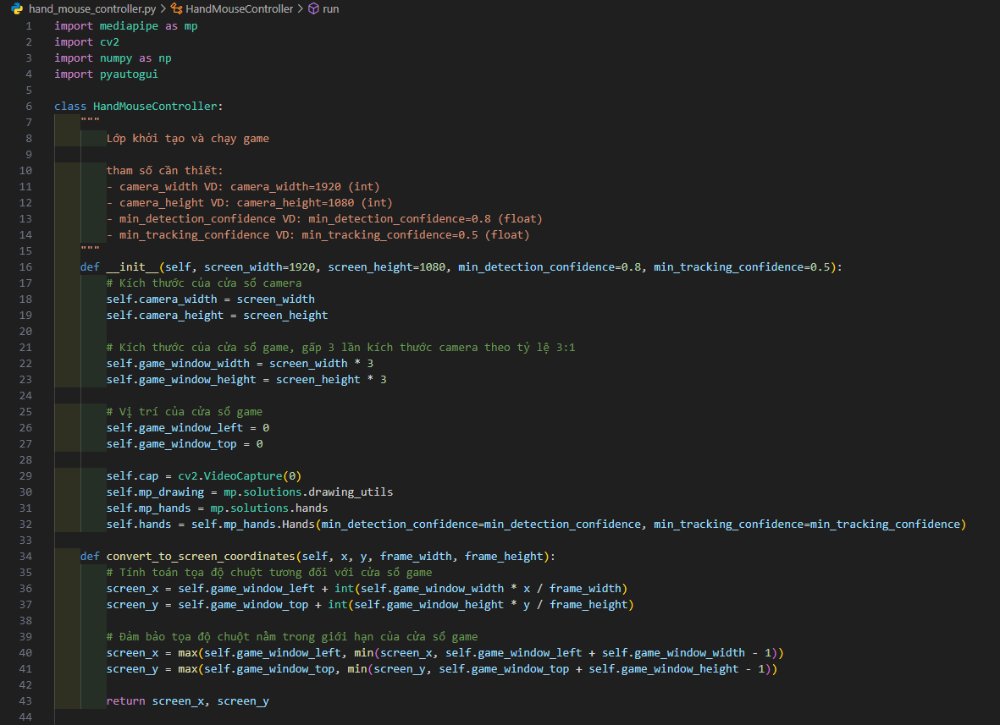
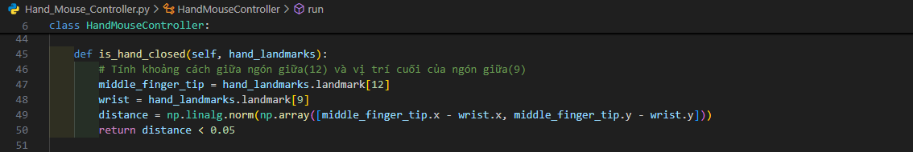
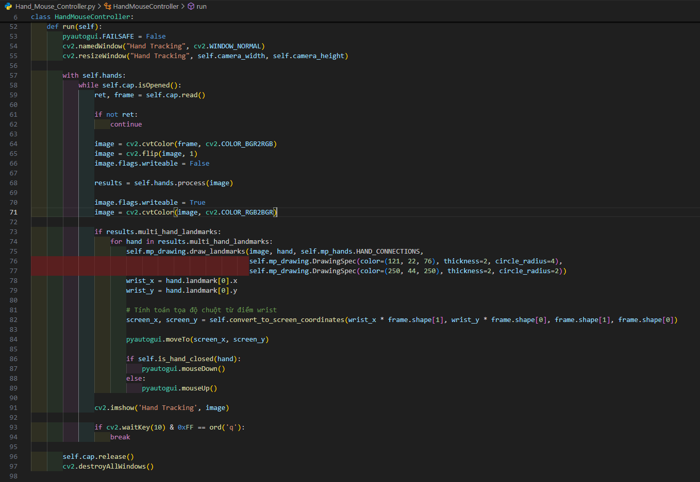
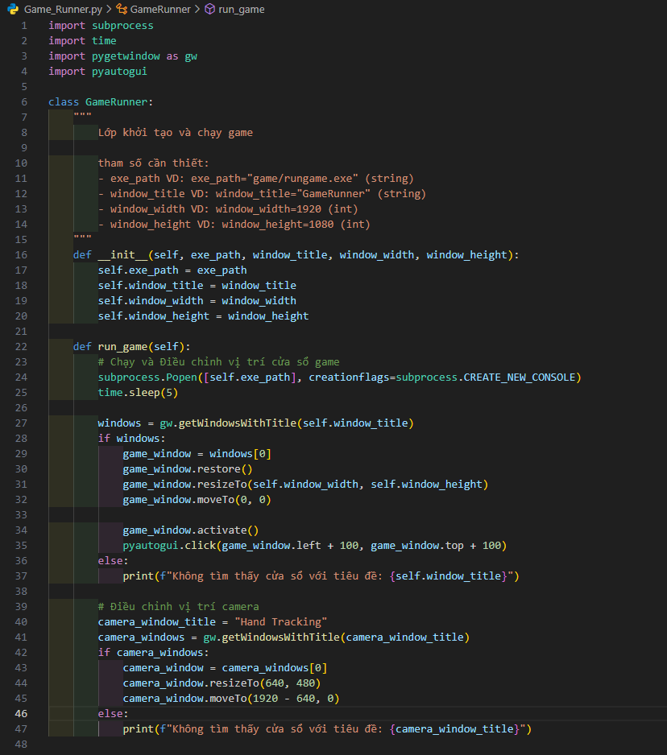
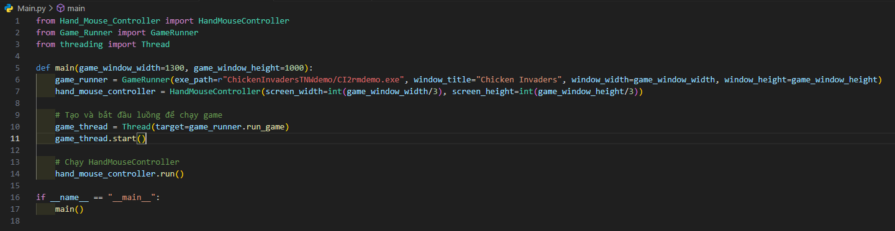

# Chicken Invaders Hand Control

This repository contains code to play Chicken Invaders using hand gestures detected by a camera. The project utilizes MediaPipe for hand tracking and PyAutoGUI for controlling mouse movements.

## Table of Contents

- [Introduction](#introduction)
- [Requirements](#requirements)
- [Installation](#installation)
- [Usage](#usage)
- [Code Overview](#code-overview)
  - [HandMouseController](#handmousecontroller)
  - [GameRunner](#gamerunner)

## Introduction

This project enables you to play Chicken Invaders using your hands. The camera tracks your hand movements and translates them into mouse movements and clicks, allowing you to control the game without using a traditional mouse.  

<iframe width="560" height="315" src="https://www.youtube.com/embed/shlkBMwmfos?autoplay=1" frameborder="0" allow="accelerometer; autoplay; clipboard-write; encrypted-media; gyroscope; picture-in-picture" allowfullscreen></iframe>

### Quick Demo Video
[](https://youtu.be/shlkBMwmfos?si=2QF0DWRr1Iv-i_Qx "Play Chicken Invaders using hand gestures detected by a camera")

## Requirements

- Python 3.10+
- OpenCV
- MediaPipe
- NumPy
- PyAutoGUI
- PyGetWindow

## Installation

1. Clone the repository:

   ```bash
   git clone https://github.com/your-username/chicken-invaders-hand-control.git
   cd chicken-invaders-hand-control
   ```

2. Install the required packages:
   ```bash
   pip install -r requirements.txt
   ```
## Usage
1. Update the "Main.py" file with the correct path to your Chicken Invaders executable if necessary (should be left as default):
   ```bash
   game_runner = GameRunner(exe_path=r"path_to_your_game_executable", window_title="Chicken Invaders", window_width=1500, window_height=1000)
   ```
2. Run the "Main.py" file:
   ```bash
   python Main.py
   ```
## Code Overview
### HandMouseController
The "Hand_Mouse_Controller" class is responsible for tracking hand movements using MediaPipe and converting these movements into mouse actions.  





### GameRunner
The "Game_Runner" class handles launching the Chicken Invaders game, adjusting the game window size and position, and ensuring the camera window is positioned correctly.  



### Running the Project
1. Ensure your camera is connected and working.

2. Run the main.py script to start the game and hand tracking:
     
   
   ```bash
    python Main.py
    ```
4. Use your hand to control the game. The wrist position will control the mouse movement, and closing your hand will simulate a mouse click.


